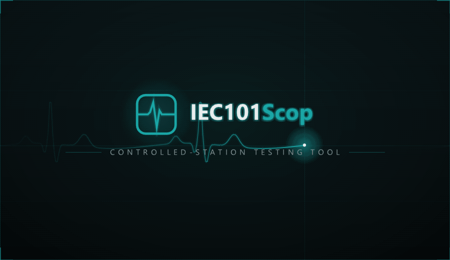

<p align="center">
  
</p>

**IEC101Scop Slave** is a free **IEC 60870-5-101 controlled-station simulator**
with a modern, dockable **Dear ImGui** interface — part of the Scop family
alongside ModbusScop, DNPScop, and IEC104Scop, sharing their look and feel. It
emulates **one or many IEC 101 stations** on a **serial line (FT1.2)** or behind a
**TCP tunnel** (terminal servers and serial-to-Ethernet gateways), in
**unbalanced** or **balanced** link mode, so engineers can test, commission, and
troubleshoot IEC 101 masters and SCADA front ends without real field hardware.

The complete IEC 101 stack — the FT1.2 link layer with its secondary-station
procedures and the ASDU / information-object codec shared with IEC104Scop — is
**hand-rolled over Asio**, with no third-party protocol library.

Free to use and redistribute under the permissive **BSD 2-Clause License**.

Developed by **Carlos Nardi**.

[](https://buymeacoffee.com/cnardi)

<p align="center">
  
</p>

## Concept

IEC101Scop Slave is organized as a tree: **Channels → RTUs → Points**.

- A **Channel** is one secondary-station link: a **Serial COM** port (baud,
  parity, stop bits) or a **TCP (FT1.2 tunnel)** listener on a bind address and
  port. Each channel sets its **link address**, the **link mode** (unbalanced /
  polled, or balanced / point-to-point with ACK timeout and retries), and the
  **-101 field sizes** (link address, cause of transmission, common address, and
  information-object address). Each channel runs on its own I/O thread; start and
  stop them independently.
- An **RTU** is one simulated station with its own **common address (CA)** inside
  a channel. A channel can host many RTUs and routes every ASDU to the matching
  common address. Each RTU has its own **cyclic**, **background-scan**, and
  **double-transmission** settings.
- Each RTU carries a **point database** — **Indications** (single-point,
  double-point, step position), **Measurands** (normalized, scaled, float),
  **Counters** (integrated totals), and **Controls** (single, double, and
  regulating-step commands, setpoints) — editable directly in the UI, each point
  with its own quality, time tag, event type, simulation, and control permission.

## Features

- **Complete hand-rolled IEC 101 stack** over Asio (no third-party library):
  **FT1.2** single-character, fixed-length, and variable-length frames with
  checksum and resynchronization; secondary-station procedures for **Reset Link**
  and **Request Status**, **FCB duplicate detection** with repeat of the last
  response, **ACD** signalling of pending Class 1 data, separate **Class 1**
  (events, command and interrogation replies) and **Class 2** (cyclic and
  background) buffers, and balanced-mode **SEND / CONFIRM** transmission with
  ACK timeout and retries.
- **Serial and TCP tunnel** — serve a master on a real COM port or accept an
  FT1.2-over-TCP connection, chosen per channel.
- **Configurable -101 profile** — link address size (0 / 1 / 2 octets), cause of
  transmission (1 octet or 2 with originator), common address (1 / 2 octets), and
  IOA (1 / 2 / 3 octets) per channel, matching the master's engineering.
- **Multi-station simulation** — many channels, each with many stations on
  distinct common addresses.
- **Full point model** — M_SP, M_DP, M_ST, M_ME_NA/NB/NC (normalized / scaled /
  float), and M_IT, each selectable per point as plain, **CP24Time2a**, or
  **CP56Time2a** time-tagged; the measurand type is switchable in place.
- **Interrogation, counters, and clock** — answers **General Interrogation
  (C_IC)** and **Counter Interrogation (C_CI)** with the station image and
  accepts **Clock Synchronization (C_CS)**, tracking the master's time offset.
- **Spontaneous, cyclic, and background transmission** — per-point
  **spontaneous** events (COT 3) on change, per-RTU **cyclic** transmission
  (COT 1) of flagged measurands, a periodic **background scan** (COT 2) of the
  whole database, and optional **double transmission** (plain type followed by
  the time-tagged twin).
- **Commands + glue logic** — executes Single (C_SC), Double (C_DC), Regulating
  Step (C_RC) and normalized / scaled / float Setpoints (C_SE_NA/NB/NC) with
  **select / execute**. A per-point **Linked IOA** mirrors the command onto a
  monitor point, and the **Glue Logic** editor maps command triggers (any / ON /
  OFF / LOWER / RAISE, by qualifier) to actions — *Set to Value*, *Pulse*,
  *Increment*, *Decrement*, *Randomize*, *Set to Command Value* — on any point.
- **Fault injection** — per-point **control permission** (Allow, Deny selection,
  Deny execution, No control — refusals mirror the command with the NEGATIVE bit)
  and per-point **quality flags** (IV, NT, SB, BL, OV).
- **Time & Date** — **Setup → Time & Date…** picks the time base every station
  stamps with: the **System** clock or a **Manual** date/time that keeps running
  once set, in a **Local** or **UTC** frame with a GMT offset that can follow the
  machine's own offset (DST-aware). Each station still layers the master's
  **C_CS** clock-sync offset on top; the effective time shows in the status bar.
- **Point Detail window** — double-click (or right-click) a row's IOA to edit
  one point in a single place: its parameters (event type, spontaneous / cyclic,
  engineering scaling, control permission, linked IOA) apply immediately, while
  value, **quality flags** and **time tag** are *staged* and applied together as
  **one** spontaneous event — optionally as the plain, CP24 or CP56 type for
  that single event. Ideal for reproducing exact event sequences.
- **Per-point simulation** — **Sine**, **Ramp**, **Random**, **Increment**, and
  **Toggle**, constrained by each point's type and paced per point, with a global
  **Start Sim / Stop Sim** button and a 0.1× – 10× speed slider.
- **Editable point windows** — a Master-style grid per RTU with sorting, multi-
  select editing that propagates to every selected point, **engineering scaling**
  (Eng Min / Eng Max / units), and **CSV export / import** of the complete point
  definition (values, quality, time tag, simulation, permissions, links).
- **Animation** — rows flash when a master commands them, when simulation or
  spontaneous events change them, or when you edit them by hand — three
  configurable colors under **Setup → Animation**; the tree blinks on traffic.
- **Communication Monitor** — a timestamped, filterable log of every frame per
  channel, master, and RTU, with a layered **link / ASDU decode** of the selected
  frame using the channel's field sizes, and optional **log-to-file** with
  size-based rotation.
- **Status Messages & Dashboard** — master connect/disconnect, command
  execution and refusal traces, clock-sync events, plus live per-channel Tx / Rx
  counters and uptime.
- **Workspaces** — save and reload your entire setup (`.i1sw`): channels
  (transport, serial parameters, link address and mode, field sizes, balanced
  ACK timing, running state), stations, points with values, quality, event types,
  simulations, permissions, links, and glue rules. Channels that were running are
  started again on load.
- **Themes** — dark / light / classic with a customizable accent color, DPI
  scaling, and always-on-top; layout and preferences are remembered between runs.

## Download & run

1. Go to the [**Releases**](../../releases) page and download the latest
   `IEC101ScopSlave` archive for Windows.
2. Unzip it anywhere and run **`IEC101ScopSlave.exe`** — no installation
   required.

**Requirements:** Windows 10/11 (64-bit).

**Rendering:** IEC101Scop Slave uses the GPU by default; you can switch to **CPU
(software)** rendering under **View → Rendering** (handy over Remote Desktop or in
VMs).

### Getting started

1. **+ Channel** — choose **Serial COM** (port, baud, parity, stop bits) or **TCP
   (FT1.2 tunnel)** (bind address, port), then set the **link address**, the
   **link mode**, and — if the master expects something other than the defaults —
   the **-101 field sizes**. The channel is created with one RTU (common address
   1) and starts immediately.
2. **Add RTU...** — add more stations, each with its own common address; open
   **Settings...** on an RTU for cyclic, background-scan, and double-transmission
   periods.
3. Open the RTU's **Points** window, add information objects by type and IOA,
   then edit values, quality, time tags, simulations, permissions, and glue logic
   directly in the grid. Press **Start Sim** to animate the simulated points.
4. Point your IEC 101 master at the COM port (or the TCP tunnel's IP and port).
   Watch the frames decode in the **Communication Monitor** and the counters in
   the **Dashboard**.

Use **File → Save Workspace** (Ctrl+S) to keep the whole configuration and reload
it later with **Open Workspace** (Ctrl+O).

## Third-party libraries

IEC101Scop Slave is built with these open-source components, each under its own
license:

| Library | Used for | License |
|---------|----------|---------|
| Dear ImGui (docking) | user interface | MIT |
| GLFW 3 | window / OpenGL context | Zlib/libpng |
| OpenGL 3 | rendering | — |
| Asio (standalone) | serial / TCP transport | Boost Software License 1.0 |
| stb_image | logo / splash decoding | MIT / public domain |

The IEC 60870-5-101 protocol stack itself (FT1.2 link layer, ASDU codec, station
database, controlled-station engine) is original code, not a third-party library.

## License

IEC101Scop Slave is released under the **BSD 2-Clause License**. It is provided
"as is", without warranty of any kind; the author is not responsible for any
damage or loss caused by its use.

```
BSD 2-Clause License

Copyright (c) 2026, Carlos Nardi
All rights reserved.

Redistribution and use in source and binary forms, with or without
modification, are permitted provided that the following conditions are met:

1. Redistributions of source code must retain the above copyright notice,
   this list of conditions and the following disclaimer.

2. Redistributions in binary form must reproduce the above copyright notice,
   this list of conditions and the following disclaimer in the documentation
   and/or other materials provided with the distribution.

THIS SOFTWARE IS PROVIDED BY THE COPYRIGHT HOLDERS AND CONTRIBUTORS "AS IS"
AND ANY EXPRESS OR IMPLIED WARRANTIES, INCLUDING, BUT NOT LIMITED TO, THE
IMPLIED WARRANTIES OF MERCHANTABILITY AND FITNESS FOR A PARTICULAR PURPOSE
ARE DISCLAIMED. IN NO EVENT SHALL THE COPYRIGHT HOLDER OR CONTRIBUTORS BE
LIABLE FOR ANY DIRECT, INDIRECT, INCIDENTAL, SPECIAL, EXEMPLARY, OR
CONSEQUENTIAL DAMAGES (INCLUDING, BUT NOT LIMITED TO, PROCUREMENT OF
SUBSTITUTE GOODS OR SERVICES; LOSS OF USE, DATA, OR PROFITS; OR BUSINESS
INTERRUPTION) HOWEVER CAUSED AND ON ANY THEORY OF LIABILITY, WHETHER IN
CONTRACT, STRICT LIABILITY, OR TORT (INCLUDING NEGLIGENCE OR OTHERWISE)
ARISING IN ANY WAY OUT OF THE USE OF THIS SOFTWARE, EVEN IF ADVISED OF THE
POSSIBILITY OF SUCH DAMAGE.
```
